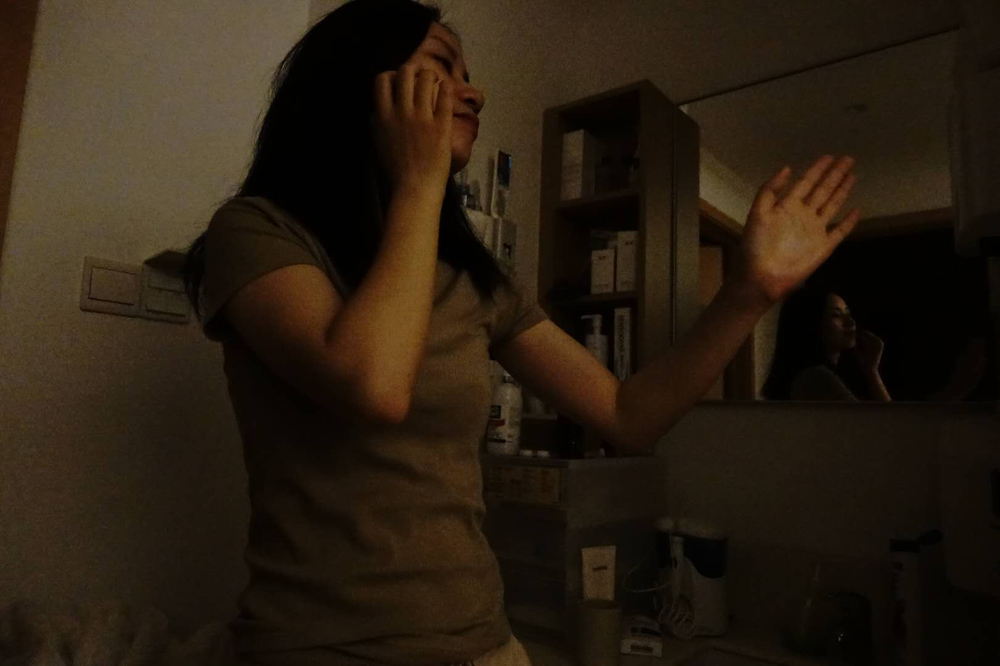
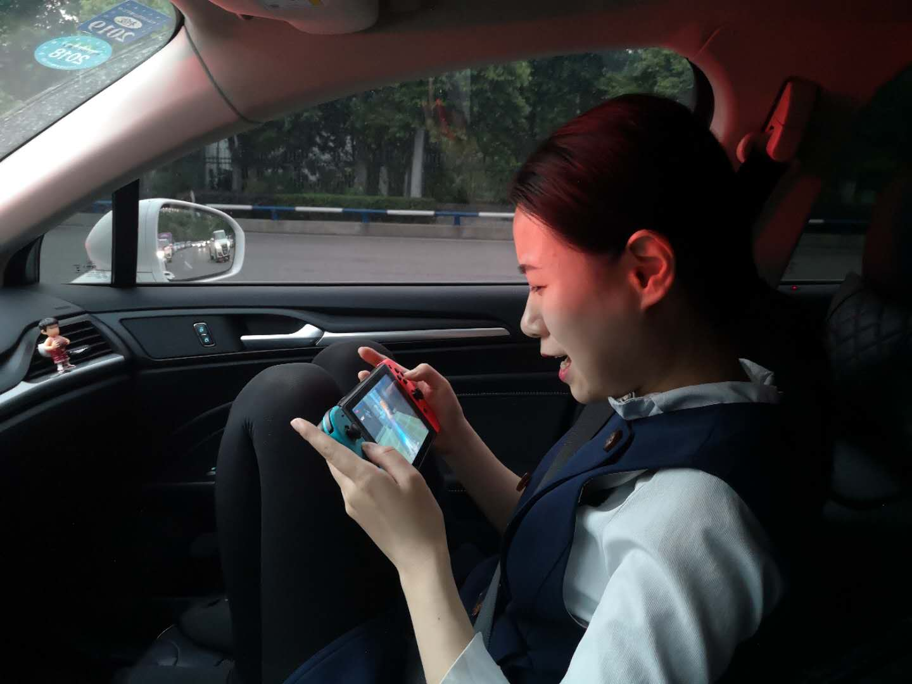
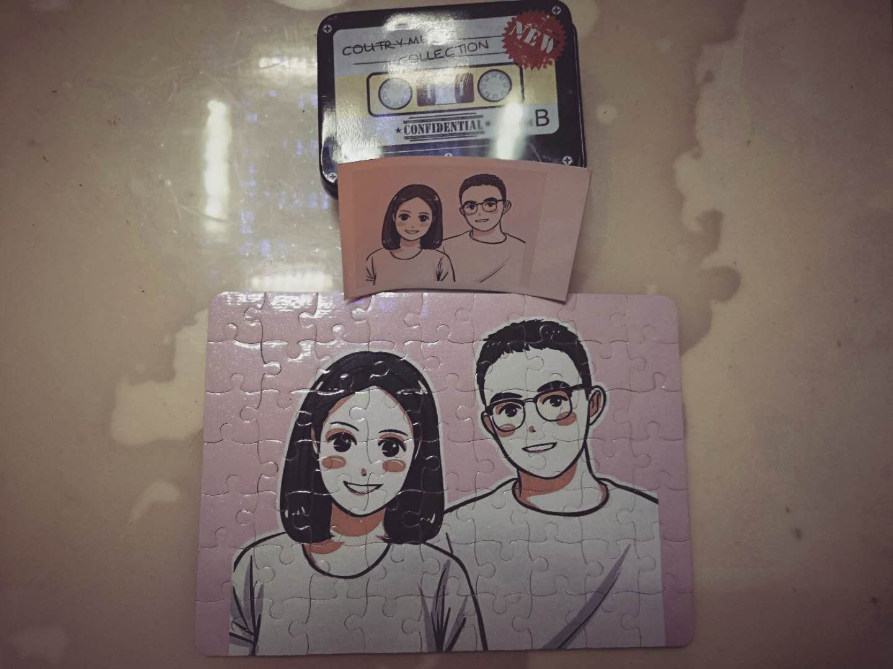
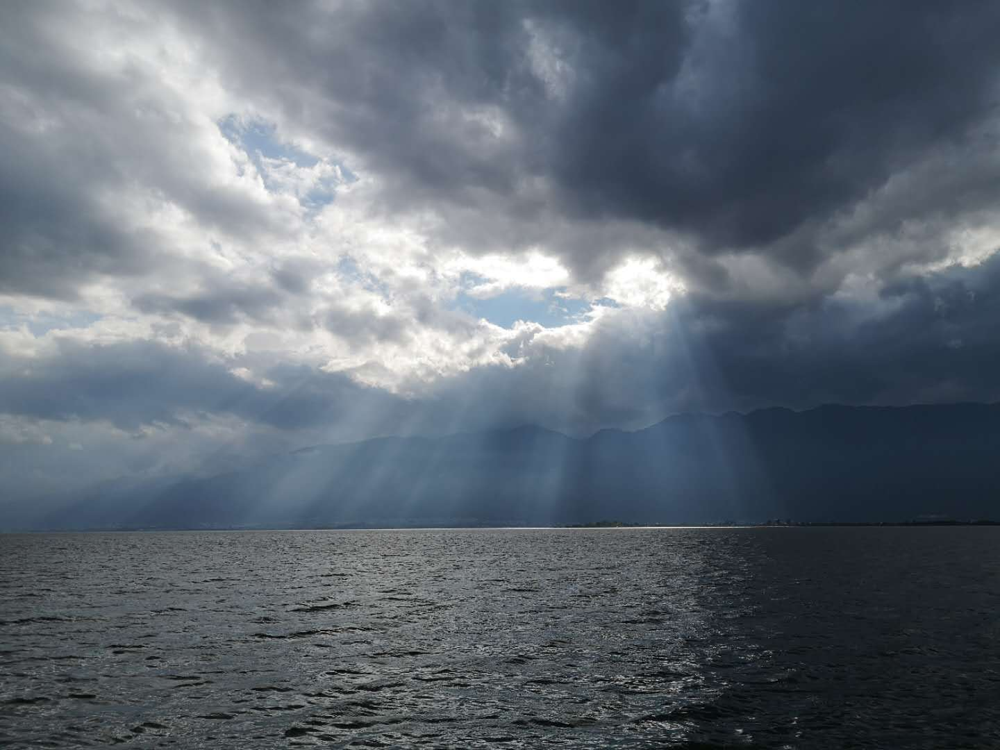

2018年的时间真的过得很快，今天打开blog发现去年就只写了一篇（结婚那篇不算)。

我现在一个人在电脑前，放着李志的2018-2019洗心革面演唱会直播，看着里面那些熟悉又陌生的人，发现每个人都有着自己的故事，精彩或平淡。不论你愿不愿意，2018年就快要过去了，时间很公平，地球没有毁灭，世界没有变得更好，人类进步或退步了，自圆其说，自欺欺人，自生自灭，自我麻醉，自我放逐。一切都是你自己看到了，就是那样。

逼哥说他已经戒烟一个半月了。每个人都在试图突破自己，真是平淡无奇，一味的在尝试新的自己。他说此时此刻是真实的，无论怎么都抵不过此时此刻，嗯，你看，他二十岁不会这样说。你的三十岁呢，四十岁呢？五十岁呢？ 

生活，梦想，现实，抱负，人得到多了就害怕失去，山顶洞人。

逼哥说他今年40岁了，今年也是改革开放40年。

上面说了太多写实的描写，说说今年吧。
今年在事业上原地踏步，装修真的是折磨人的东西，耗费了很多精力，没有坚持学习英语，没有坚持跑步，没有坚持自律，所以没有取得本来就不该拥有的收获。但是很开心，没心没肺的和老婆生活在这个偌大的城市，像两只小蚂蚁，睡姿像两只老鼠，想吃想喝统统满足，没有很大的包袱，这样的日子如果一直持续下去也挺好的，有烦恼，最后都还是解决了。

阳光，白云，路过，离开，于是就死去

雨淋，闪电，伫立，跪下，然后就轮回

2019年，三十岁了，没有活明白。也不知道说什么，会在每天早上早起，会在夜晚晚睡，会坚持锻炼，会给自己制造很多麻烦。会找到一种方式和这个世界和解吗？

### 就想跳舞

### 啊，生活

### 简单而好笑

### 未来

## 关于2018年的随机记忆
结婚
没心没肺的生活
塞尔达真的很好玩
没有度蜜月
再去了云南
喝了很多杯咖啡
听了7、8场演唱会
家里的被窝很舒服
腹肌若隐若现

新年：自律

https://music.163.com/#/song?id=29734857

More info [link](./)

