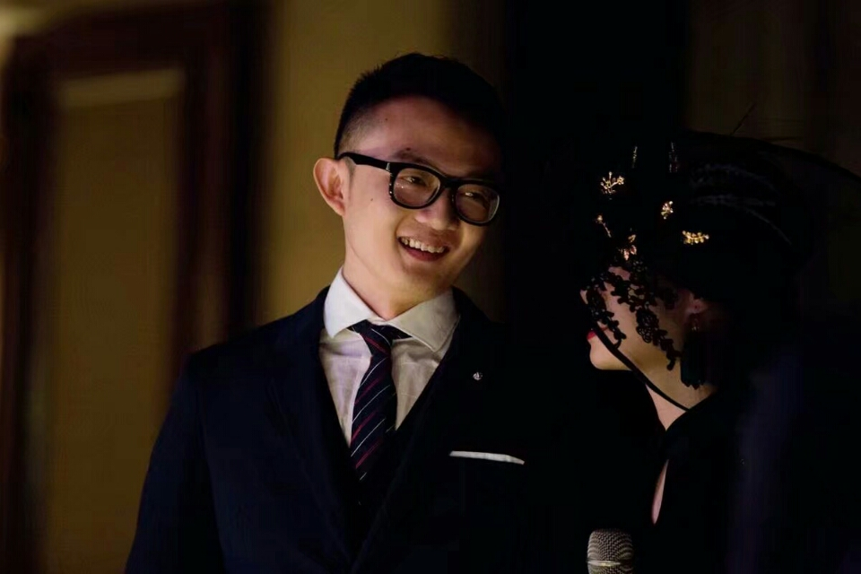
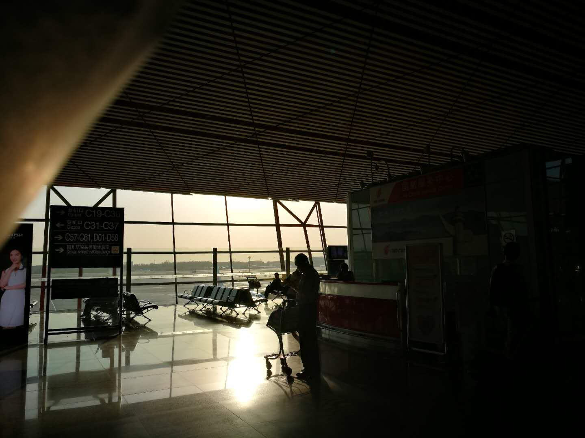
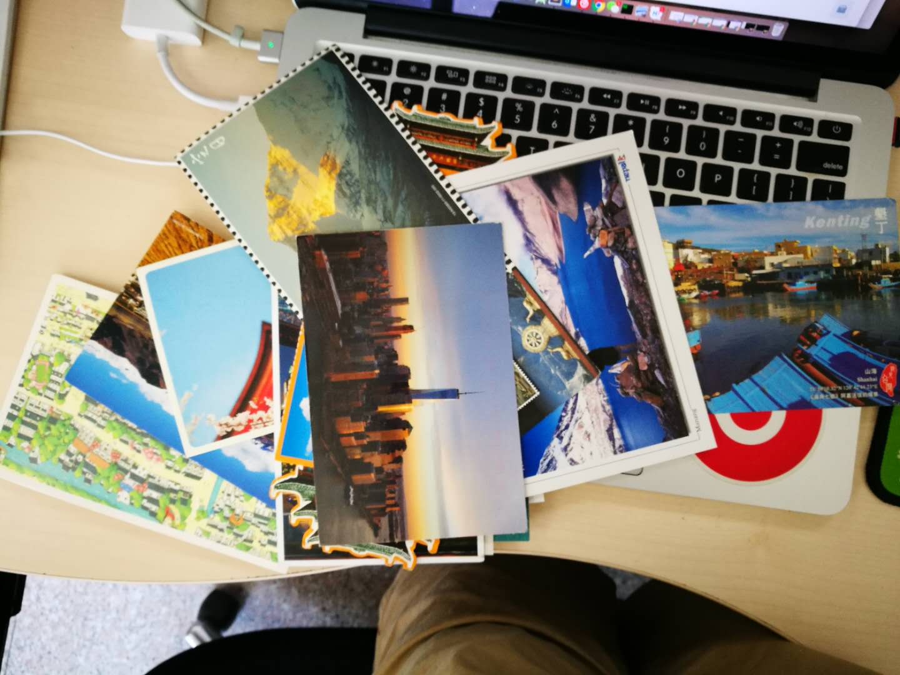
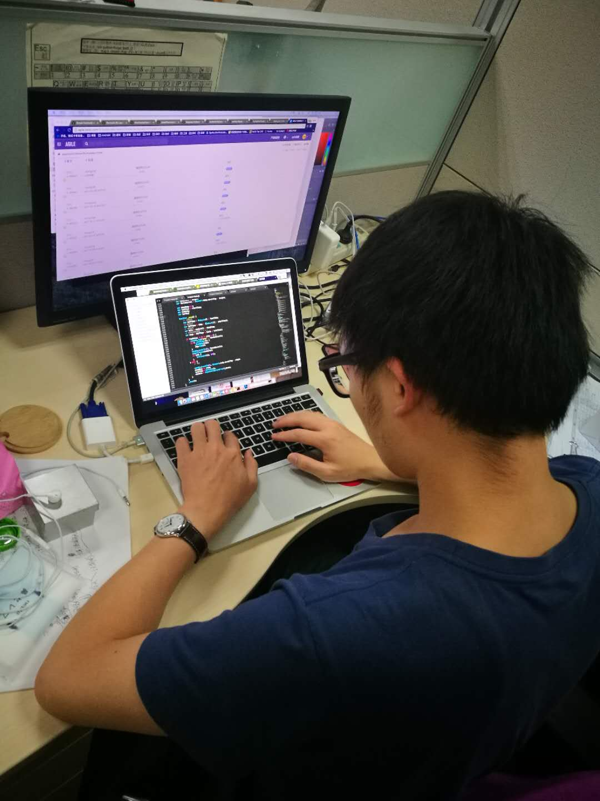
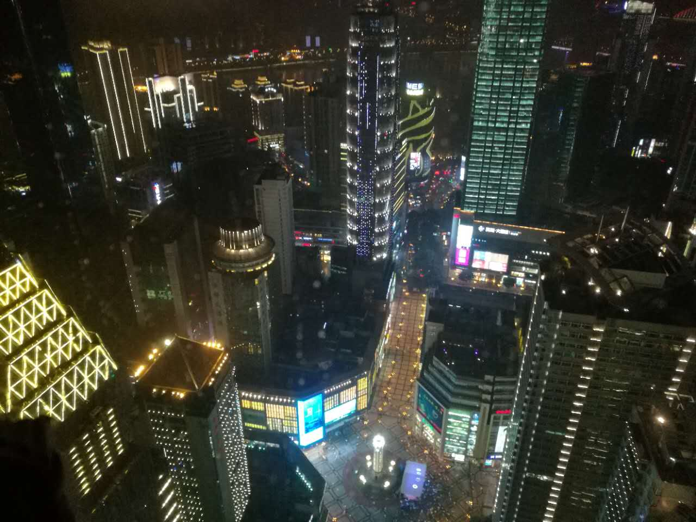
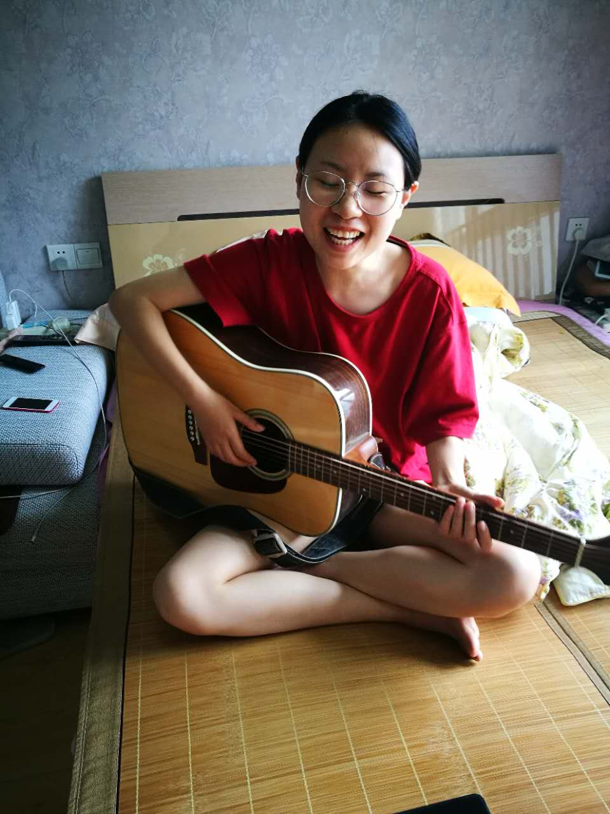

是的，中国传统的2018年已来到了，因为各种原因，2017的总结差点难产，过程多么艰辛就不去描述了。总之就是博客源码迁移过来了，也有了备份，很多音乐因为版权问题无法播放了，不做不会更好，做了也没有变得更差。

## 结婚

是的，在过去的一年里，我踏上了婚姻的殿堂，开启了新的任务关卡，新娘就是大家熟悉的杨小姐。

我们放弃了传统的婚礼形式，举办了我们两个人的个人演唱会。唱几首老歌，回忆几件往昔旧事，有突然想起的话，有酝酿已久的话。都在那天说了。那天起的很早，那天睡得也很早，那天其实不能更好了。

那天放了这些歌。

<!-- more -->

1.最大的勇敢，是征服自己的意气《To Vals》
2.I'm driving too fast, I'm drving too far《Lemon Tree》 
3.Make You Feel My Love《Make You Feel My Love》 
4.Love Me Like There's No Tomorrow《Love Me Like There's No Tomorrow》
5.我发觉我最爱与你编写 以后明天的深夜《每天爱你多一些》
6.My oceans deep my rivers wide《Oceans Deep》
7.那时候天总是很蓝 日子总过得太慢《同桌的你》
8.有谁会让我觉得这夜晚还有期盼 我就会跟着它去远行《忽然》
9.何日再追 何地再醉 说今夜真美《似是故人来》
10 因为我为你奉献出所有来爱你《All of me》

## 生活与工作

离开了北京，回到了重庆
时间过得真快，一晃都五年了，还是很感激在北京遇到的人和事。那里仿佛是我的第二个故乡。我时常会回忆起某些细节，在阳光下，在夜色中，在地铁上，在出租屋里，天气很好不想出门，午休后醒来天已经黑了，北京风大，北京干燥，北京还有很多文娱活动。中肯的一句评价，抛开哪些买房、子女读书的现实问题，北京绝对是应届毕业生最佳选择。这里有很多机会，这里只要努力就有希望。这里就像是《北京人在纽约》里面提到的纽约--如果你爱他，请带他去纽约，因为那是天堂；如果你很他，请带他去纽约，因为那是地狱。

这里不再去讨论你北京怎样了，没有对错，跟着心走就行。

重庆才是家，并且我深深爱着她。
### 回家的落日

### 明信片

### baidu 我的第一份工作

### 重庆

### 重庆的智障小盆友

## 关于2017年的随机记忆
1.完成了一次半马，另外一个小盆友仅仅完成了迷你马拉松，说好的锻炼身体，又开始在心中萌芽了。
2.完成了一次国外自驾游，还会想去更多地方。
3.听了很多演唱会，并且在同一年听了两场朴树的演唱会，一次重庆，一次北京。张学友，田馥甄，林宥嘉。但是依旧没能完成在热河路跨年的愿望，不过没事，有缘自然见，江湖这么大。
4.老婆送了 hhkb pro2 和 switch 作为礼物，很幸福。
5.高墙之下自己开了 vps 走了专线，这个世界会好吗？
6.时间过得真快。以至于我匆匆的结束了这篇几乎难产的《我的2017》

今天偏爱这一首 
<iframe frameborder="no" border="0" marginwidth="0" marginheight="0" width=330 height=86 src="//music.163.com/outchain/player?type=2&id=26289183&auto=1&height=66"></iframe>

More info [link](./)

