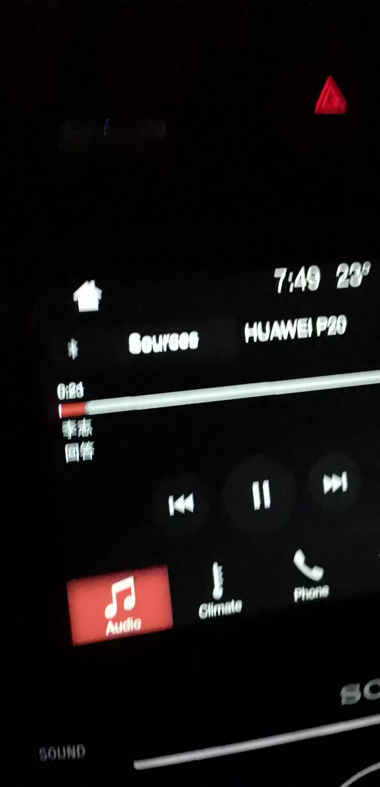

上一次有记录的冲动是什么时候，都想不起来了，总之就是打算回家写一篇感想，可是后来到家后就没有下文了。
今天下班开车回家前突然想到这一次会不会也不了了之，还考虑要不要在车里完成了再走，不过下一秒，又已经开出了产业园。

## 一首路上放的歌

是的，我也开始面对这个题目了。但是我一点都不慌。

<!-- more -->

我已经很久没使用国内的任何新闻、传媒软件了，什么抖音，头条，快手、网易新闻，包括有信息流的百度都换成了简单搜索。因为我发现现在的新闻咨询根本没法看。或者这样说，看多了会自卑，世界越来越好，但是内心世界却越来越不好。

于是开始捡回来了RSS，订阅一些自己还能看进去的。

## 最近有人问我在干什么? 那么我回说:我在☟

而且我很赞同，在不就的将来，这将成为一门手艺活。中国码农的平均技术突飞猛进和我们国情是分不开的。厉害了，爱学习的码农们。

## 国庆去哪里玩？

我想我会去元阳吧

## 那么什么是中年危机
我想我很认真的回答一下 -----   我还很年轻，我像新生的婴儿一样，我现在面对的成长危机，要是养成了不良的习惯就完了。

## 文明之光

今天偏爱这一首

<iframe frameborder="no" border="0" marginwidth="0" marginheight="0" width=330 height=86 src="//music.163.com/outchain/player?type=2&id=446969694&auto=1&height=66"></iframe>

More info [link](./)

